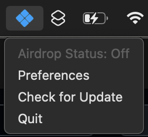
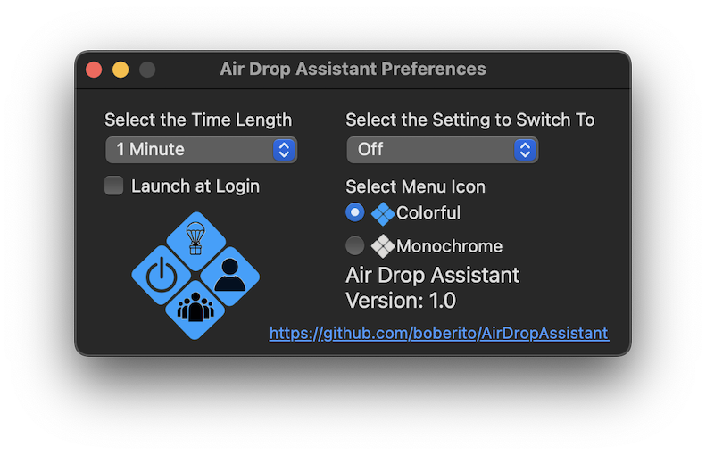

<div id="header" align="center">
  
</div>

Air Drop Assistant (ADA) allows you more control over your Airdrop Settings.

On iOS, when switching AirDrop to Everyone, it switches back to Contacts Only after 10 minutes. This feature does not exist on macOS.

ADA allows you to set if AirDrop goes to Contacts Only or Off and the time frame to switch it.

Why might you want this feature?
- You use your computer frequently in public spaces and do not want AirDrop set to be left open to receive from Everyone.
- Organizations allow AirDrop but want more granular control than Apple's device management gives you.


<div align="center">
    
</div>

ADA can be configured by configuration profile deployed by your MDM.

**Domain** `com.ttinc.Air-Drop-Assistant`

`airDropSetting` - **Type: String**
Acceptable Value: **Contacts Only** or **Off**
- When set ADA will be locked to switch AirDrop to that settings after the timer.

`timing` - **Type: Integer**
Acceptable Value: **0-1000**
- Time length before ADA will switch AirDrop to the value from `airDropSetting`

`hideMenuIcon` - **Type: Boolean**
Acceptable Value: **true** or **false**
- Hides the menu bar icon

`icon_mode` - **Type: String**
Acceptable Value: **colorful** or **bw**
- Makes the icon colorful or monochrome.

`afterFirstLaunch` - **Type: Boolean**
Acceptable Value: **true** or **false**
- Hides the first launch question.

ADA can also be registered to load at login with the argument register and removed from login items as well.

`/Applications/Utilities/Air\ Drop\ Assistant.app/Contents/MacOS/Air\ Drop\ Assistant --register`

and

`/Applications/Utilities/Air\ Drop\ Assistant.app/Contents/MacOS/Air\ Drop\ Assistant --unregister`

Example mobileconfig
```
<?xml version="1.0" encoding="UTF-8"?>
<!DOCTYPE plist PUBLIC "-//Apple//DTD PLIST 1.0//EN" "http://www.apple.com/DTDs/PropertyList-1.0.dtd">
<plist version="1.0">
<dict>
    <key>PayloadContent</key>
    <array>
        <dict>
            <key>PayloadIdentifier</key>
            <string>com.bob.Air-Drop-Assistant.26F7424C-FEF3-4E94-8E78-2673B2B8CDD3</string>
            <key>PayloadType</key>
            <string>com.bob.Air-Drop-Assistant</string>
            <key>PayloadUUID</key>
            <string>26F7424C-FEF3-4E94-8E78-2673B2B8CDD3</string>
            <key>PayloadVersion</key>
            <integer>1</integer>
            <key>airDropSetting</key>
            <string>Contacts Only</string>
            <key>timing</key>
            <integer>5</integer>
            <key>hideMenuIcon</key>
            <true/>
            <key>icon_mode</key>
            <string>colorful</string>
            <key>afterFirstLaunch</key>
            <true/>
        </dict>
    </array>
    <key>PayloadDescription</key>
    <string>ADA Settings</string>
    <key>PayloadDisplayName</key>
    <string>ADA</string>
    <key>PayloadIdentifier</key>
    <string>com.bob.Air-Drop-Assistant</string>
    <key>PayloadOrganization</key>
    <string>BOB</string>
    <key>PayloadScope</key>
    <string>System</string>
    <key>PayloadType</key>
    <string>Configuration</string>
    <key>PayloadUUID</key>
    <string>1BBD23DE-7ED7-45DF-8126-5085A681ED83</string>
    <key>PayloadVersion</key>
    <integer>1</integer>
</dict>
</plist>
```
