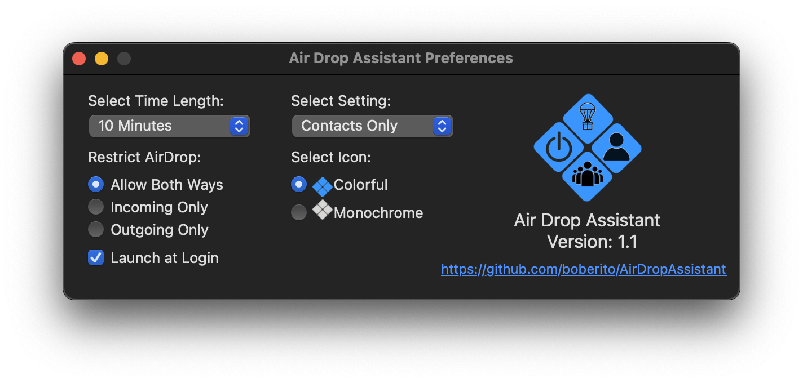

Air Drop Assistant (ADA) allows you more control over your Airdrop Settings.

On iOS, when switching AirDrop to Everyone, it switches back to Contacts Only after 10 minutes. This feature does not exist on macOS.

ADA allows you to set if AirDrop goes to Contacts Only or Off and the time frame.




```
domain com.ttinc.Air-Drop-Assistant
<key>airDropSetting</key>
<string>Contacts Only/Off</string>
<key>timing</key>
<integer>1-100</integer>
<key>hideMenuIcon</key>
<true/>/<false/>
<key>icon_mode</key>
<string>colorful/bw</string>
<key>afterFirstLaunch</key>
<true/>
```

Example mobileconfig
```
<?xml version="1.0" encoding="UTF-8"?>
<!DOCTYPE plist PUBLIC "-//Apple//DTD PLIST 1.0//EN" "http://www.apple.com/DTDs/PropertyList-1.0.dtd">
<plist version="1.0">
<dict>
    <key>PayloadContent</key>
    <array>
        <dict>
            <key>PayloadIdentifier</key>
            <string>com.bob.Air-Drop-Assistant.26F7424C-FEF3-4E94-8E78-2673B2B8CDD3</string>
            <key>PayloadType</key>
            <string>com.bob.Air-Drop-Assistant</string>
            <key>PayloadUUID</key>
            <string>26F7424C-FEF3-4E94-8E78-2673B2B8CDD3</string>
            <key>PayloadVersion</key>
            <integer>1</integer>
            <key>airDropSetting</key>
            <string>Contacts Only</string>
            <key>timing</key>
            <integer>5</integer>
            <key>hideMenuIcon</key>
            <true/>
            <key>icon_mode</key>
            <string>colorful</string>
            <key>afterFirstLaunch</key>
            <true/>
        </dict>
    </array>
    <key>PayloadDescription</key>
    <string>ADA Settings</string>
    <key>PayloadDisplayName</key>
    <string>ADA</string>
    <key>PayloadIdentifier</key>
    <string>com.bob.Air-Drop-Assistant</string>
    <key>PayloadOrganization</key>
    <string>BOB</string>
    <key>PayloadScope</key>
    <string>System</string>
    <key>PayloadType</key>
    <string>Configuration</string>
    <key>PayloadUUID</key>
    <string>1BBD23DE-7ED7-45DF-8126-5085A681ED83</string>
    <key>PayloadVersion</key>
    <integer>1</integer>
</dict>
</plist>
```
